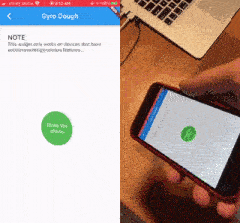

# Dough Library

Squishy widgets for Flutter and the web.

## Quick Links

- [Flutter Dough](./packages/dough/README.md)
- [Dough JS](./packages/dough-js/readme.md)

## Demos

Here are a few samples of the different widgets provided by this repo. You can find more information on how to use these widgets in the main [Dough](./packages/dough/README.md) project.

### Pressable Dough

### Draggable Dough

### Gyro Dough

### Custom Dough

