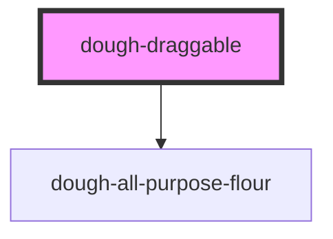

# dough-draggable

<!-- Auto Generated Below -->

## Properties

| Property    | Attribute   | Description                                                                                               | Type     | Default |
| ----------- | ----------- | --------------------------------------------------------------------------------------------------------- | -------- | ------- |
| `adhesion`  | `adhesion`  | The adhesion of the dough. The higher the number, the more the dough will stick to its original position. | `number` | `4`     |
| `viscosity` | `viscosity` | The viscosity of the dough. The higher the number, the more the dough will resist movement.               | `number` | `4`     |

## Events

| Event            | Description | Type                                     |
| ---------------- | ----------- | ---------------------------------------- |
| `doughDragEnd`   |             | `CustomEvent<{ x: number; y: number; }>` |
| `doughDragMove`  |             | `CustomEvent<{ x: number; y: number; }>` |
| `doughDragStart` |             | `CustomEvent<{ x: number; y: number; }>` |

## Dependencies

### Depends on

- [dough-all-purpose-flour](../dough-all-purpose-flour)

### Graph

----------------------------------------------

*Built with [StencilJS](https://stenciljs.com/)*
