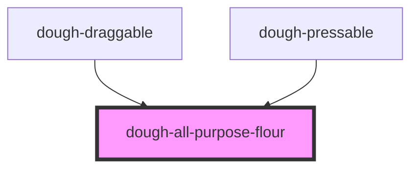

# dough-all-purpose-flour

<!-- Auto Generated Below -->

## Properties

| Property    | Attribute   | Description                                                                                                                      | Type      | Default |
| ----------- | ----------- | -------------------------------------------------------------------------------------------------------------------------------- | --------- | ------- |
| `active`    | `active`    | Set active to true when you want to manipulate the dough. Set to false when you want it to smooth back to its original position. | `boolean` | `false` |
| `adhesion`  | `adhesion`  | The adhesion of the dough. The higher the number, the more the dough will stick to its original position.                        | `number`  | `4`     |
| `originX`   | `origin-x`  | The origin X coordinate of the dough. This is the point that the dough will try to return to.                                    | `number`  | `0`     |
| `originY`   | `origin-y`  | The origin Y coordinate of the dough. This is the point that the dough will try to return to.                                    | `number`  | `0`     |
| `targetX`   | `target-x`  | The target X coordinate of the dough. This is the point that the dough will try to move to.                                      | `number`  | `0`     |
| `targetY`   | `target-y`  | The target Y coordinate of the dough. This is the point that the dough will try to move to.                                      | `number`  | `0`     |
| `viscosity` | `viscosity` | The viscosity of the dough. The higher the number, the more the dough will resist movement.                                      | `number`  | `4`     |

## Dependencies

### Used by

 - [dough-draggable](../dough-draggable)
 - [dough-pressable](../dough-pressable)

### Graph

----------------------------------------------

*Built with [StencilJS](https://stenciljs.com/)*
