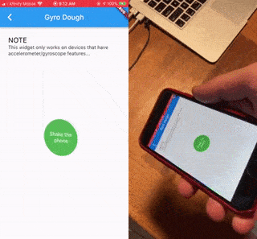

<p align="center">
<a href="https://pub.dev/packages/dough_sensors"></a>
<a href="https://github.com/josiahsrc/dough"></a>
<a href="https://pub.dev/packages/very_good_analysis"></a>
<a href="https://github.com/Solido/awesome-flutter#standard"></a>
<a href="https://opensource.org/licenses/MIT"></a>
</p>

This package provides some smooshy widgets that integrate with system sensors. The system sensor integration is made possible by [sensors_plus](https://pub.dev/packages/sensors_plus).
- [Flutter package](https://pub.dev/packages/dough_sensors)
- [Source code](https://github.com/josiahsrc/dough)

<br>

> Hi there 👋 😁
> 
> If this if your first time looking at dough, check out the main [Dough Project](https://pub.dev/packages/dough) for an overview on what Dough is.

<br>

## Platform Support

| Android |  iOS  | MacOS |  Web  | Linux | Windows |
| :-----: | :---: | :---: | :---: | :---: | :-----: |
|   ✔️     |   ✔️   |       |   ✔️   |       |         |

## How to use

This package provides squishy widgets you can use right out of the box. Optionally, you can create custom Dough widgets for a custom squish effect. See the main [Dough Project](https://pub.dev/packages/dough) for details on how to do that.

<br>

### Gyro Dough

Wrap any widget in `GyroDough` to make it squish based on how a user moves their phone around in physical space. This widget only works on devices that have accelerometer/gyroscope features.

```
GyroDough(
    child: Container( ... ),
);
```

You can find a full example of how to use this widget [here](example/lib/demos/gyro_dough_demo.dart).



<br>

## Customize how the Dough feels

If you don't like the default dough settings, you can easily change how the dough feels. See docs [here](../dough/README.md#customize-how-the-dough-feels).

<br>

---

<br>

## Contributing

Contributions to this package are always welcome! Please read the [contributing guidlines](../../CONTRIBUTING.md).
- If you have an idea/suggestion/bug-report, feel free to [create a ticket](https://github.com/josiahsrc/dough/issues/new/choose).
- If you created a custom `Dough` widget or some other awesome feature that you want to share with the community, you can fork the [repository](https://github.com/josiahsrc/dough) and submit a pull request!

<br>

---

keywords: dough, rubber, elastic, rubber-band, rubberband, stretchy, squishy, smooshy, linear-algebra, matrix, transformation, flexible, draggable, drag, pressable, custom, ui, ux, interactive, animation, engage