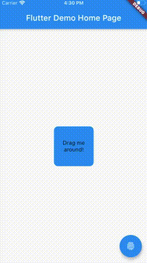
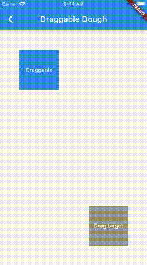

This package provides some widgets you can use to create a smooshy UI.

- [Source code](https://github.com/josiahsrc/dough)

<!-- a yellow warning that this package is in alpha -->


## How to use

This package provides squishy UI components that you can use right out of the box. Or, optionally, you can create your own.

### Pressable Dough

Wrap any component in `dough-pressable` to make it squish based on a user's input gestures.

```html
<dough-pressable>
  
</dough-pressable>
```



### Draggable Dough

`dough-draggable` allows you to drag and drop components around... Only this time it's squishy!

```html
<dough-draggable>
  
</dough-draggable>
```



### Make your own Dough

If the above widgets aren't exactly what you're looking for, you can easily create your own squishy component using the provided `dough-all-purpose-flour` component! Check out the `dough-pressable` implementation for how to do that.


---

## Customize how the Dough feels

If you don't like the default dough settings, you can easily change how the dough feels. Just update the provided `viscosity` and `adhesion` parameters.

```html
<dough-draggable viscosity="10" adhesion="4">
  
</dough-draggable>
```

---

## Contributing

Contributions to this package are always welcome! Please read the [contributing guidlines](../../CONTRIBUTING.md).

- If you have an idea/suggestion/bug-report, feel free to [create a ticket](https://github.com/josiahsrc/dough/issues).
- If you created a custom `Dough` widget or some other awesome feature that you want to share with the community, you can fork the [repository](https://github.com/josiahsrc/dough) and submit a pull request!

---

keywords: dough, rubber, elastic, rubber-band, rubberband, stretchy, squishy, smooshy, linear-algebra, matrix, transformation, flexible, draggable, drag, pressable, custom, ui, ux, interactive, animation, engage, stencil, react, angular, vue, flutter, web, mobile, responsive
